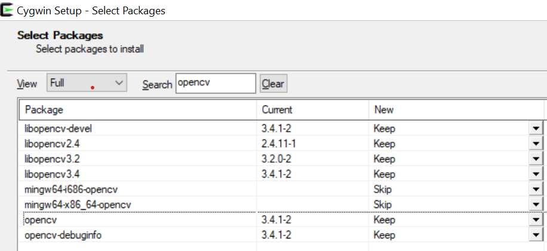

# green_eye_project
A program that converts images into grayscale. the project can be run with or without multi-threads.

## requirements
 the program can be used only on Windows OS
 - cpp compiler
 - opencv
      - for installing opencv:
          - open cygwin setup
          - when reaching the 'Select Packages' page, change the View option to be 'Full' and search for opencv.
          - under the label, 'new' is suppose to be 'keep' (if you have it already) or 'install' (with the relevant latest version)
          
          
        
 

## How to run the code
each directory (/test, /ImageToGray, /ImageToGrayMT) has it's own cmakelist.txt file.
the project needs also a directory of images to be passed as the argument of each executable.

to run it from cmd you need to go to the desired directory and from there run:

     
     cmake .
     make
     <name_of_executable> <C:\path\to\images\directory>
     
the converted images will be saved in the same directory path you provided with the name 'image_<last_saved_id+1>.jpg'.
For the first image, the last_saved_id will be 0. Therefore its name will be “image_1.jpg” 

the test files includes:
- running a benchmark between the native and the multi-threaded implementation
- checking the runtime of the multi-threaded implementation vs. the number of running threads.
